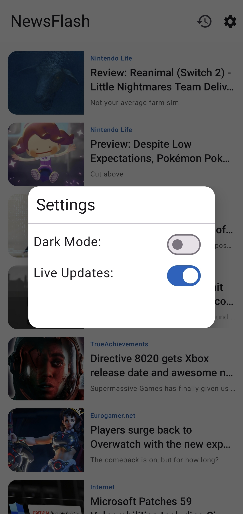

# 📰 NewsFlash

Modern Android News Application built using **Kotlin** and **Jetpack Compose**.

NewsFlash demonstrates modern Android development practices including MVVM architecture, reactive state management, offline awareness, DataStore persistence, and Material 3 UI design.

---

## ✨ Features

- 🗞 Fetch latest news using NewsAPI
- 🎨 Built entirely with Jetpack Compose
- 🌙 Classic Blue Dark Theme (Material 3)
- 🔄 Pull-to-Refresh support
- 📡 Offline state detection with proper UI feedback
- 💾 DataStore integration:
  - Save user preference (Switch state)
  - Save & restore last opened article
  - Article history tracking
- 🎬 Smooth UI animations
- 🧭 Clean and modern UI design

---

## 🏗 Architecture

The app follows **MVVM (Model-View-ViewModel)** architecture to ensure:

- Clear separation of concerns
- Lifecycle-aware state handling
- Scalable and maintainable code structure

State is managed using Kotlin Coroutines and Flow.

---

## 🛠 Tech Stack

- Kotlin
- Jetpack Compose
- Material 3
- MVVM Architecture
- NewsAPI
- DataStore (Preferences)
- Coroutines & Flow

---

## 📸 Screenshots

<p align="center">
  
  
  
  
  
</p>

---

## 🚀 Setup & Installation

1. Clone the repository:

```bash
git clone https://github.com/ParsaGhazvinian/newsflash.git
```

2. Open the project in Android Studio.

3. Add your NewsAPI key.

You can obtain one from:
https://newsapi.org

Add your API key in the appropriate constants/configuration file.

4. Build and run the project.

---

## 🔐 API Configuration

This project requires a NewsAPI key.

For security reasons, avoid committing your API key directly into version control.

Recommended approach:
- Store it inside `local.properties`
- Or use BuildConfig fields

---

## 📌 Future Improvements

- Bookmark feature
- Pagination support
- Category filtering
- Local caching strategy
- Unit & UI testing
- Dependency Injection (Hilt)

---

## 📄 License

This project is created for educational and portfolio purposes.

---

## 👤 Author

Developed as a modern Android learning project showcasing Jetpack Compose and current Android best practices.
